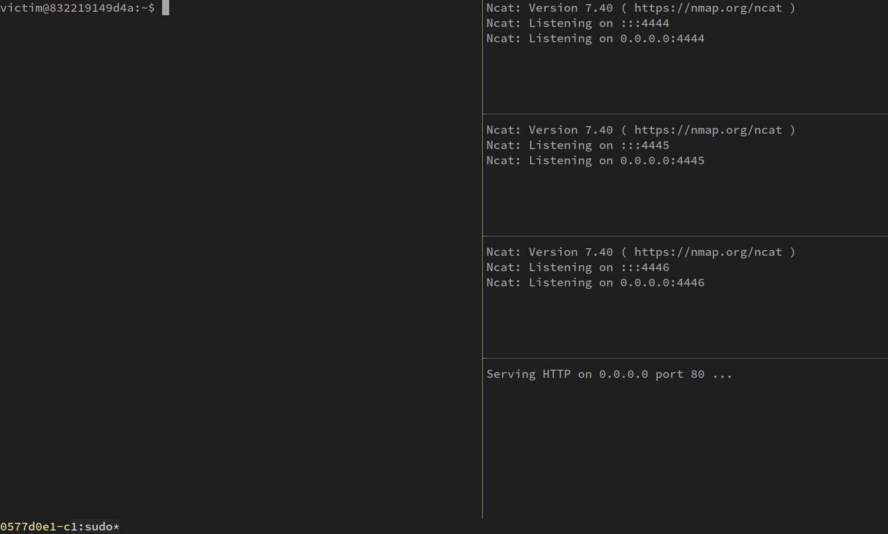

# Demo - End-to-end Git, RVM and Visual Studio Code exploitation

This is an end-to-end demo with exploits for Git, RVM and Visual Studio Code.

It simulates two different machines using Docker - a victim machine, and an
attacker machine. The attacker invites the victim to do a `git clone
--recursive` which exploits CVE-2018-17456 in an old version of Git. The victim
then uses `cd` to change directory to the cloned repository, triggering
CVE-2017-1000037 in an old version of RVM. Finally, the victim does `code .` to
view the code in Visual Studio Code, which triggers a vulnerability in an old
version of VSCode.

## References

* Git bug - <https://cve.mitre.org/cgi-bin/cvename.cgi?name=CVE-2018-17456>
* RVM bug - <https://github.com/justinsteven/advisories/blob/master/2017_rvm_cd_command_execution.md#rvm-automatically-executes-hooks-located-in-pwd>
* VSCode bug - <https://github.com/justinsteven/advisories/blob/master/2017_visual_studio_code_workspace_settings_code_execution.md>


## Contents

* `up.sh` - does a `docker-compose up` to bring up the demo containers
* `attach.sh` - attaches several `tmux` panes to the demo containers
* `docker-compose.yml` - specifies how the demo containers should be brought up
* `image_attacker/` - specifies the attacker's Docker image
* `image_victim/` - specifies the victim's Docker image

## Dependencies

This demo does some awful things with `tmux` to attach to the demo containers
in a visually pleasing manner. You will need to have `tmux` installed, and you
will need to be comfortable with switching between `tmux` panes to run this
demo.

## Instructions

Review `up.sh` and `attach.sh` (and the rest of the files for good measure)

Run `up.sh`:

```
[justin@diablo ~/work/ides_of_march/demo_end_to_end]% ./up.sh
WARNING

The victim container will have SYS_PTRACE capability. This might allow for
container escape.

The victim container will have access to your host's X socket. This allows for
container escape.

Malicious code running in this container might try to escape to your host.
Do you want to continue? [yN] y

Going to remove demoendtoend_victim_1, demoendtoend_attacker_1
Removing demoendtoend_victim_1 ... done
Removing demoendtoend_attacker_1 ... done
Building attacker
Step 1/5 : FROM debian:stretch
 ---> 2d337f242f07

[... SNIP ...]

Step 5/5 : COPY gitpwn.git /www/totally_not_malicious.git
 ---> Using cache
 ---> c004564a6661
Successfully built c004564a6661
Successfully tagged demoendtoend_attacker:latest
Building victim
Step 1/16 : FROM debian:stretch
 ---> 2d337f242f07

[... SNIP ...]

Step 16/16 : WORKDIR /home/victim/
 ---> Using cache
 ---> 64561c0e5933
Successfully built 64561c0e5933
Successfully tagged demoendtoend_victim:latest
Creating demoendtoend_attacker_1
Creating demoendtoend_victim_1
Attaching to demoendtoend_attacker_1, demoendtoend_victim_1
```

Run `attach.sh`:

```
[justin@diablo ~/work/ides_of_march/demo_end_to_end]% ./attach.sh
```



## License

`image_attacker/gitpwn.git` contains an exploit obtained from
<https://www.exploit-db.com/exploits/45631>

`image_victim/git*.deb` was obtained from <https://snapshot.debian.org/>. It is
Copyright: © 2005-2016, Linus Torvalds and others and is licensed under GPL-2

`image_victim/rvm_1.28.0.tar.gz` is (c) 2009-2011 Wayne E. Seguin, 2011-2016
Michal Papis, 2016 Piotr Kuczynski. It is licensed under the Apache License,
Version 2.0 and was obtained from <https://github.com/rvm/rvm/tree/master>

`image_victim/code_1.7.2-1479766213_amd64.deb` is licensed, as follows, under
the MIT License.

```
MIT License

Copyright (c) 2015 - present Microsoft Corporation

All rights reserved.

Permission is hereby granted, free of charge, to any person obtaining a copy
of this software and associated documentation files (the "Software"), to deal
in the Software without restriction, including without limitation the rights
to use, copy, modify, merge, publish, distribute, sublicense, and/or sell
copies of the Software, and to permit persons to whom the Software is
furnished to do so, subject to the following conditions:

The above copyright notice and this permission notice shall be included in all
copies or substantial portions of the Software.

THE SOFTWARE IS PROVIDED "AS IS", WITHOUT WARRANTY OF ANY KIND, EXPRESS OR
IMPLIED, INCLUDING BUT NOT LIMITED TO THE WARRANTIES OF MERCHANTABILITY,
FITNESS FOR A PARTICULAR PURPOSE AND NONINFRINGEMENT. IN NO EVENT SHALL THE
AUTHORS OR COPYRIGHT HOLDERS BE LIABLE FOR ANY CLAIM, DAMAGES OR OTHER
LIABILITY, WHETHER IN AN ACTION OF CONTRACT, TORT OR OTHERWISE, ARISING FROM,
OUT OF OR IN CONNECTION WITH THE SOFTWARE OR THE USE OR OTHER DEALINGS IN THE
SOFTWARE.
```

All other code is (c) Justin Steven 2019 and is licensed under the Apache
License, Version 2.0. It is provided on an "as is" basis, without warranties or
conditions of any kind.
